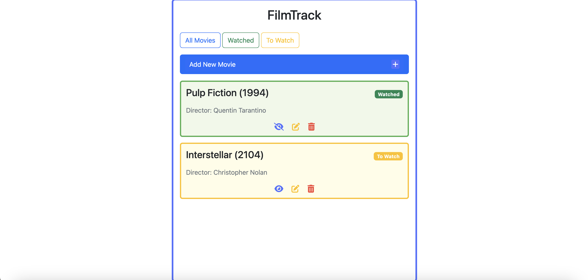
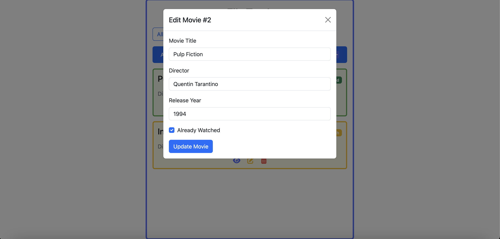
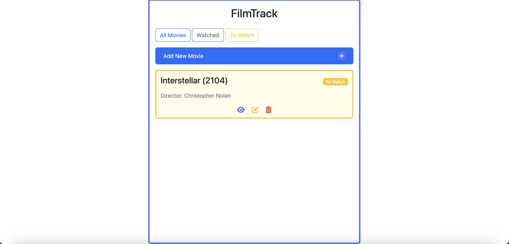

# Movie Watchlist

A web application to track and manage your movie watchlist. Keep track of movies you've watched and movies you plan to watch in the future.

## Features

- Add movies with title, director, and release year information
- Mark movies as watched or unwatched
- Filter your list to show all movies, only watched movies, or only unwatched movies
- Edit movie details
- Delete movies from your list
- Toggle watched/unwatched status with a single click

## Technologies Used

- **Backend**: FastAPI (Python)
- **Frontend**: 
  - HTML
  - CSS
  - JavaScript
  - Bootstrap 5 for responsive design
  - Font Awesome 6 for icons

## Installation

1. Clone this repository
```bash
git clone https://github.com/yourusername/movie-watchlist.git
cd movie-watchlist

2. Create and activate a virtual environment
# For Windows
python -m venv venv
venv\Scripts\activate

# For macOS/Linux
python3 -m venv venv
source venv/bin/activate

3. Install the required dependencies
pip install fastapi uvicorn

4. Run the application
uvicorn main:app --reload

5. Open your browser and navigate to http://127.0.0.1:8000
```
# Demo



